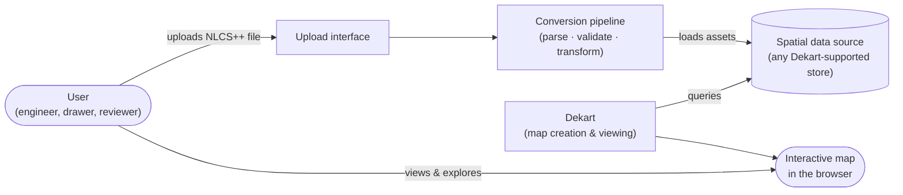

# Overview & System Context

## Purpose

This project makes **NLCS++ files** (the NLCS Netbeheer XML exchange format used by Dutch grid
operators) viewable on an **interactive web map**, using [Dekart](https://dekart.xyz) as the
map viewing platform.

Today, an NLCS++ file is a drawing-exchange artifact: it travels between contractors
(aannemers) and grid operators (netbeheerders) as part of the drawing workflow, and it can
realistically only be opened in specialised CAD tooling. Anyone who just wants to *see* what a
drawing contains — which cables, joints, and cabinets it describes and where they are — needs a
CAD licence and CAD skills. This project removes that barrier: a user uploads an NLCS++ file
and gets an interactive map in the browser.

## Who uses it

| User | Need |
|------|------|
| Engineer / work planner at a grid operator | Quickly inspect a delivered drawing without CAD software |
| Drawer / contractor (aannemer) | Verify what a produced NLCS++ file actually contains before submitting it |
| Reviewer / data quality checker | Browse assets and their attributes (status, ownership, function) on a map |

## The key architectural fact

**Dekart does not read files.** Dekart is a map analytics tool that visualizes the results of
queries against a connected data source — it has no notion of XML, GML, or NLCS. This single
fact shapes the whole architecture: between the NLCS++ file and the Dekart map there must be a
**conversion pipeline** that parses the file, converts its geometry to web-map coordinates, and
loads the result into a data source Dekart can query.

## System context

The user's mental model is simple — *"I upload a drawing, I get a map"* — but the system
realises this in two decoupled halves:

1. **Getting data in**: upload → conversion → spatial data source (this project's own work).
2. **Getting maps out**: Dekart queries the data source and renders the map (off-the-shelf).

## Scope

**In scope**

- Manual upload of a single NLCS++ file by a user.
- Converting that file's project area and asset features into a queryable, georeferenced form.
- Viewing the drawing as an interactive map in Dekart: layers per asset category, attributes
  visible per asset, filtering, and sharing a map with colleagues.

**Out of scope (future considerations)**

- **Revision comparison** — visualising what changed between two revisions of the same
  drawing. The format supports the scenario (revised files of the same project exist), and it
  is a natural extension, but nothing is designed for it now.
- **Automated / batch ingestion** — files arriving from another system without a user action.
- **Editing** — this is a viewer; the system never modifies or produces NLCS++ files.

## Document set

| Document | Contents |
|----------|----------|
| [01-overview.md](01-overview.md) | This document — purpose, context, scope |
| [02-nlcs-data-format.md](02-nlcs-data-format.md) | What an NLCS++ file is, conceptually |
| [03-system-architecture.md](03-system-architecture.md) | Components, responsibilities, and data flow |
| [04-visualization-with-dekart.md](04-visualization-with-dekart.md) | How drawings become maps in Dekart |

These documents are intentionally free of low-level technical specification: no schemas, no
code, no version numbers, no configuration. They orient a development team; implementation
choices are made later, by that team.
