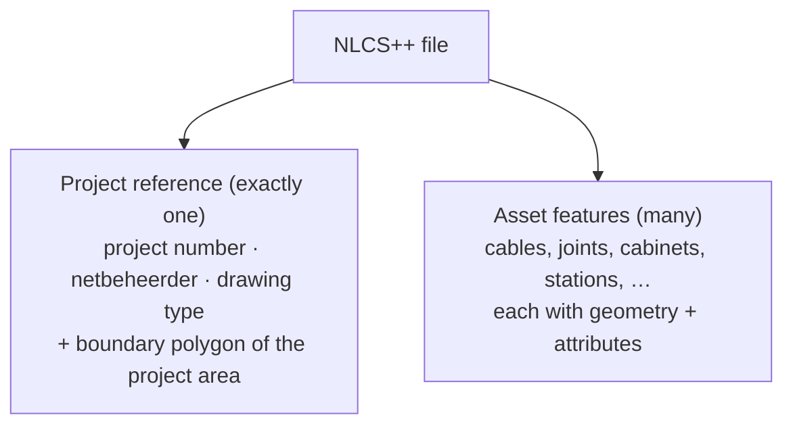

# The NLCS++ Data Format (Conceptual)

## What an NLCS++ file represents

An NLCS++ file (formally: the **NLCS Netbeheer** XML exchange format) is a **georeferenced
utility-network drawing**. It is the machine-readable counterpart of the CAD drawing a
contractor delivers to a grid operator such as Enexis: everything drawn — cables, joints,
cabinets, stations — is present as a data record with real-world coordinates and descriptive
attributes.

Two properties make the format well suited for map viewing:

- **Everything is georeferenced.** Every feature carries geometry in the Dutch national
  coordinate system, so the drawing can be placed on a real map without guesswork.
- **Everything is typed and attributed.** A cable is not "a line with a colour" but an
  *LSkabel* with a status, an owner, a function, and a construction date.

An example file is included in this repository at
`data/enexis_voorbeeld_3092025_1554.xml`, together with the official schema it validates
against. Files are validated against that schema; its details are deliberately not repeated
here.

## Conceptual structure

A file has two parts:

### 1. The project reference

Every file opens with a single project reference (*AprojectReferentie*): the project number,
the responsible grid operator, the drawing type (for example an existing-situation or a
revision drawing), and — importantly for a viewer — a **boundary polygon** outlining the
project area. This polygon is the natural "frame" of the map: it tells the viewer where to
zoom to before any asset is drawn.

### 2. The asset features

The remainder of the file is a flat list of asset features. Each feature belongs to a named
asset category from the electricity-network domain. The categories present in the example
file, and what they mean:

| Category (Dutch term) | What it is | Typical geometry |
|-----------------------|------------|------------------|
| **LSkabel** / **MSkabel** | Low-voltage / medium-voltage cable | Line |
| **LSmof** | Cable joint (mof) connecting or branching cables | Point |
| **LSkast** | Low-voltage distribution cabinet | Small polygon |
| **MSstation** | Medium-voltage station | Polygon |
| **LSoverdrachtspunt** / **OVLoverdrachtspunt** | Transfer point where the network hands over to a customer connection or to public lighting (openbare verlichting) | Point |
| **Amantelbuis** | Casing pipe that carries cables, with its contents listed separately | Line |

The full format defines more categories than this (it covers the breadth of what grid
operators exchange); a viewer should treat the set of categories as open-ended rather than
hard-coding exactly these.

### Attributes

Asset features share a family of descriptive attributes. The ones that matter most for
viewing, because users will want to see, filter, and colour by them:

- **Status** — lifecycle state of the asset in this drawing: existing (*BESTAAND*), new,
  removed, and so on. On a revision drawing this is what distinguishes untouched network from
  work that was done.
- **Bedrijfstoestand** — operational state, such as *IN BEDRIJF* (in service).
- **Eigenaar / Beheerder** — who owns and who manages the asset (typically the netbeheerder,
  but not always).
- **Functie** — the asset's role, e.g. a joint that serves as a connection branch
  (*AANSLUIT AFTAK*), or a cable's network function.
- **DatumAanleg** — construction date.
- **Identifiers** — each feature carries a unique ID within the file and may carry an asset ID
  referencing the grid operator's asset registration.

Not every attribute is present on every feature; the viewer should treat attributes as
optional descriptive data, not as guaranteed fields.

## Geometry and coordinates

Features carry standard geometry shapes (the format builds on GML, the Geography Markup
Language):

- **Points** — joints, transfer points.
- **Lines** — cables, casing pipes.
- **Polygons** — the project boundary, cabinets, stations.

All coordinates are in the **Dutch national coordinate system** (Rijksdriehoekscoördinaten,
"RD"), sometimes with a height component (NAP). RD is the system Dutch engineering data lives
in, but **web map technology universally expects WGS84 latitude/longitude**. Converting RD to
WGS84 is therefore a mandatory step in the conversion pipeline — it is a well-understood,
standard transformation, but it must happen, and it must happen accurately: utility data is
drawn at centimetre precision, and a sloppy conversion visibly misplaces cables relative to
the base map.

One more practical note: a single file may mix coordinate reference variants (planar RD and
RD-with-height), so the conversion step must handle both and must discard or ignore the height
component for 2D map viewing.

## What the format is *not*

- It is **not a visual format**. Line styles, symbols, and layout conventions of the NLCS
  drawing standard are not what the viewer reproduces; the viewer presents the *data* on a
  map, not a facsimile of the CAD sheet.
- It is **not a live network model**. A file is a snapshot exchanged for one project; it does
  not claim completeness beyond the project area.
