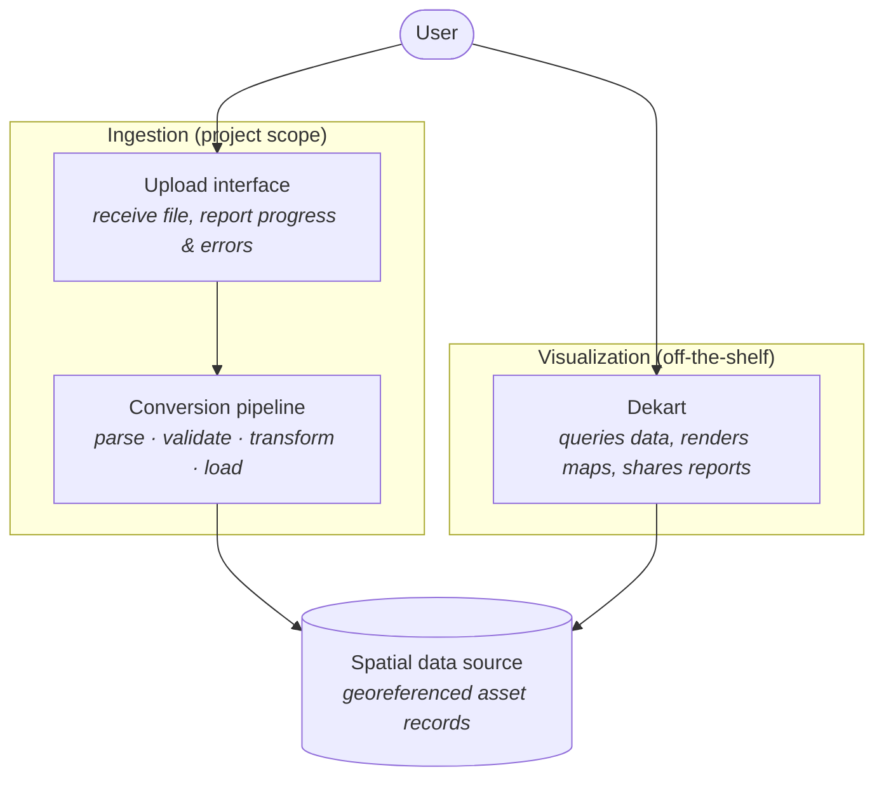
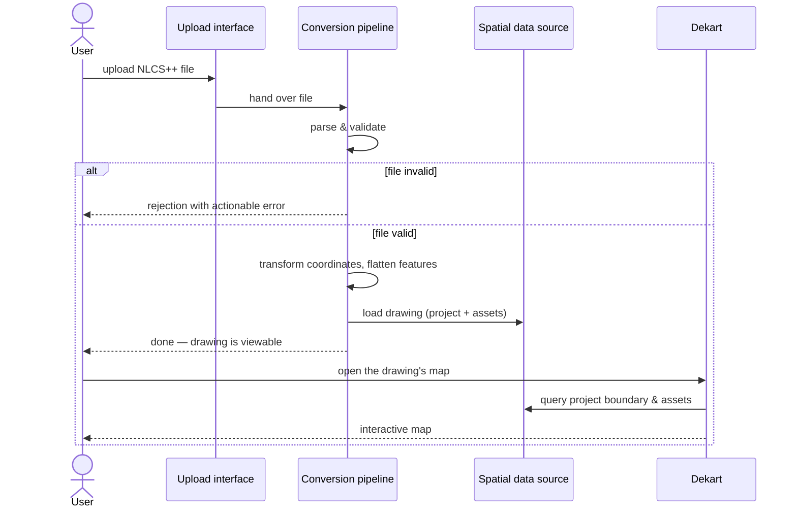
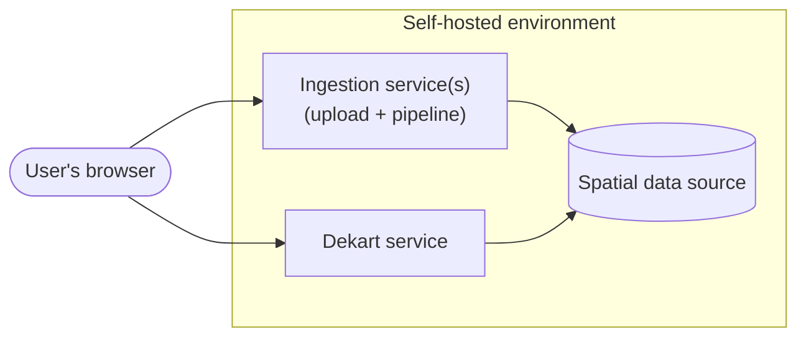

# System Architecture & Data Flow

## Design principle

The architecture is split into two decoupled halves joined by a data store:

- **Ingestion** (this project's own work): everything needed to turn an uploaded NLCS++ file
  into clean, georeferenced records in a spatial data source.
- **Visualization** (off-the-shelf): Dekart, which queries that data source and renders
  interactive maps. Dekart is used as-is; no part of the design depends on modifying it.

The data store in the middle is deliberately left abstract: it is **any Dekart-supported data
source with geospatial support** (a relational database with a spatial extension, such as
PostgreSQL/PostGIS, or a cloud data warehouse). The architecture only requires that it can
store geometry alongside attributes and answer Dekart's queries; the concrete product is an
implementation choice.

## Component view

### Upload interface

The user-facing entry point of the ingestion half. Responsibilities:

- Accept an NLCS++ file from a user (files are large but not huge — hundreds of kilobytes to
  a few megabytes).
- Give immediate, human-readable feedback: accepted, rejected (and why), processing, done.
- Hand the file to the conversion pipeline and, on success, point the user to where the
  drawing can be viewed.

This can be a minimal web page or even a command-line step in a first iteration; its contract
is "file in, viewable drawing out", not any particular interface style.

### Conversion pipeline

The heart of the system. It performs four conceptual steps, in order:

1. **Parse** — read the XML, recognise the project reference and the asset features. The set
   of asset categories must be treated as open-ended (see the format document): unknown
   categories should be carried through generically, not dropped silently.
2. **Validate** — check the file against the official schema and reject files that do not
   conform, with an error message a drawer can act on. Garbage that reaches the map erodes
   trust in the viewer.
3. **Transform** — convert geometry from Dutch RD coordinates to WGS84 (handling both the
   planar and the with-height variants), and flatten each feature into a record: geometry +
   asset category + attributes + the project it belongs to.
4. **Load** — write the records into the spatial data source, grouped under the uploaded
   drawing, so that one drawing's assets can be queried (and later deleted or replaced) as a
   unit. Re-uploading the same drawing replaces its previous content rather than duplicating
   it.

### Spatial data source

Holds the converted drawings. Conceptually it stores, per uploaded drawing: the project
reference (metadata + boundary), and one record per asset feature (category, geometry,
attributes). It is the *only* integration point between the two halves — Dekart never sees an
XML file, and the pipeline never talks to Dekart.

### Dekart

Provides everything map-related: query-driven layers, rendering (via Kepler.gl), interactive
exploration, and shareable map reports. How drawings are presented in Dekart is described in
[04-visualization-with-dekart.md](04-visualization-with-dekart.md).

## Data flow: from file to map

Narratively: the user uploads a file and either gets a clear rejection or, within moments, a
confirmation that the drawing is viewable. Opening the map in Dekart runs queries against the
data source — typically one query per asset category, so that cables, joints, cabinets, and
stations arrive as separate map layers — plus the project boundary as an orientation layer
that frames the initial view.

## Deployment context

All components are self-hostable and run as independent services:

- Dekart ships as a single self-contained service and is deployed unmodified.
- The ingestion half is this project's deliverable; whether upload and pipeline are one
  service or two is an implementation choice.
- The spatial data source is shared infrastructure between the two halves.

No further deployment detail (sizing, networking, configuration) belongs in this document.

## Future considerations

Not designed for now, but the architecture should not make them impossible:

- **Revision comparison.** The repository already holds two revisions of the same example
  drawing. Because the pipeline stores each uploaded drawing as its own unit with full
  attributes (including *Status*), comparing two uploads of the same project — or simply
  colouring by status on a revision drawing — is a natural extension on the visualization
  side, requiring no change to the ingestion design.
- **Automated ingestion.** The pipeline is deliberately separated from the upload interface;
  a batch or system-to-system trigger can feed the same pipeline later.
- **Multiple grid operators.** The example data is Enexis-flavoured (grid operators refine
  the format with their own choice lists), but the pipeline should only rely on the common
  format, keeping other netbeheerders' files ingestible.
