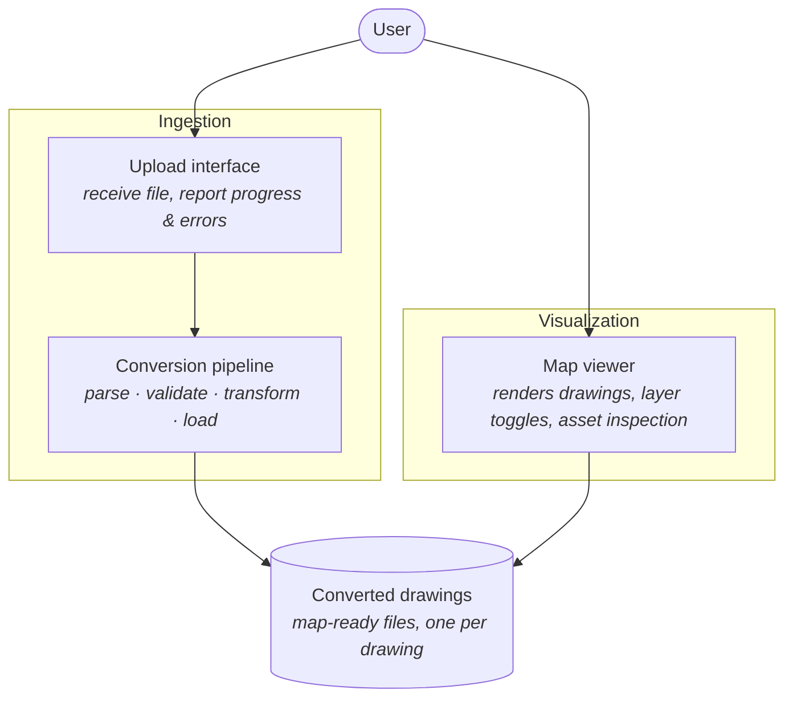
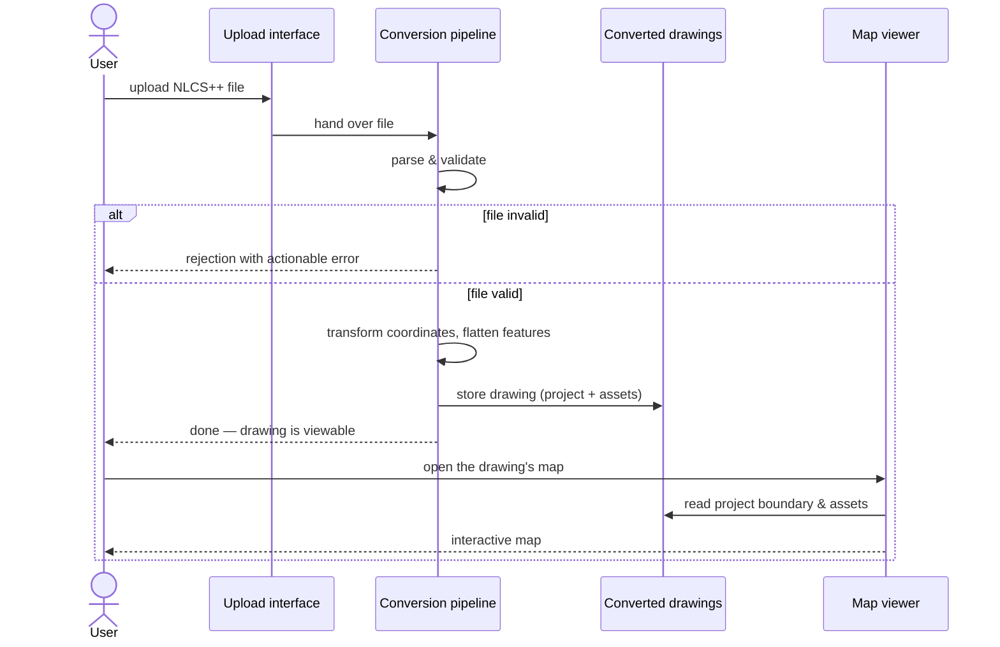
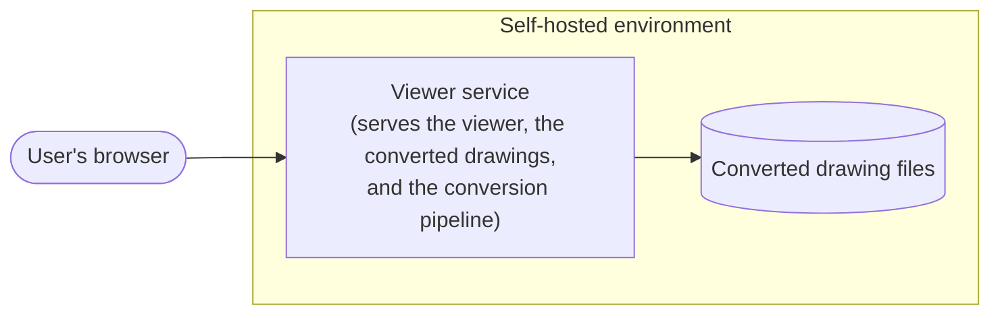

# System Architecture & Data Flow

## Design principle

The architecture is split into two decoupled halves joined by a store of converted drawings:

- **Ingestion**: everything needed to turn an uploaded NLCS++ file into clean, georeferenced,
  map-ready drawing data.
- **Visualization**: the project's own map viewer — a web application built on an open-source
  web-mapping library (MapLibre GL JS) — which reads that converted data and renders
  interactive maps.

Both halves are this project's own work. The visualization half was originally planned as
off-the-shelf Dekart, used unmodified; that changed with the platform decision recorded in
the task roadmap (task 002): the interface needs custom controls (in-viewer upload, layer
selection per drawing and per object type, object search) that an off-the-shelf tool does not
offer, and a custom viewer owns the whole UI. Dekart remains usable alongside for ad-hoc
analysis, but nothing in the design depends on it.

The store in the middle is deliberately simple: **map-ready drawing files** (one converted
file per drawing, geometry plus attributes in web-map coordinates) that the viewer reads.
The architecture only requires that a drawing's assets can be stored, listed, replaced, and
read as a unit; a shared spatial database remains a possible future evolution — see
[Future considerations](#future-considerations).

## Component view

### Upload interface

The user-facing entry point of the ingestion half. Responsibilities:

- Accept an NLCS++ file from a user (files are large but not huge — hundreds of kilobytes to
  a few megabytes).
- Give immediate, human-readable feedback: accepted, rejected (and why), processing, done.
- Hand the file to the conversion pipeline and, on success, show the drawing in the viewer.

Its home is the viewer itself (an in-viewer upload control, per the task roadmap); a
command-line step serves the same contract in a first iteration. The contract is "file in,
viewable drawing out", not any particular interface style.

### Conversion pipeline

The heart of the system. It performs four conceptual steps, in order:

1. **Parse** — read the XML, recognise the project reference and the asset features. The set
   of asset categories must be treated as open-ended (see the format document): unknown
   categories should be carried through generically, not dropped silently.
2. **Validate** — check the file against the official schema and reject files that do not
   conform, with an error message a drawer can act on. Garbage that reaches the map erodes
   trust in the viewer.
3. **Transform** — convert geometry from Dutch RD coordinates to WGS84 (handling both the
   planar and the with-height variants), and flatten each feature into a record: geometry +
   asset category + attributes + the project it belongs to.
4. **Load** — write the converted drawing to the store as a unit, so that one drawing can be
   listed, read, and later deleted or replaced as a whole. Re-uploading the same drawing
   replaces its previous content rather than duplicating it.

### Converted drawings store

Holds the converted drawings: per uploaded drawing, the project reference (metadata +
boundary) and one feature per asset (category, geometry, attributes), together in one
map-ready file. It is the integration point between the two halves — the viewer never sees
an NLCS++ file, and the pipeline never talks to the viewer directly.

### Map viewer

Provides everything map-related: rendering the drawings as layered interactive maps,
toggling what is visible, and inspecting any asset's attributes. How drawings are presented
is described in [04-visualization.md](04-visualization.md).

## Data flow: from file to map

Narratively: the user uploads a file and either gets a clear rejection or, within moments, a
confirmation that the drawing is viewable. Opening the map shows the drawing's assets as
separate layers — cables, joints, cabinets, and stations each toggleable on their own — plus
the project boundary as an orientation layer that frames the initial view.

## Deployment context

The system is self-hostable and deliberately small:

- One service serves the viewer application and the converted drawings, and runs the
  conversion pipeline for uploads; whether upload and pipeline ever split into their own
  service is an implementation choice.
- Utility network data is sensitive; self-hosting keeps the whole stack inside the
  organisation's own environment, with the organisation's own authentication in front of it.

No further deployment detail (sizing, networking, configuration) belongs in this document.

## Future considerations

Not designed for now, but the architecture should not make them impossible:

- **Revision comparison.** The repository already holds two revisions of the same example
  drawing. Because each uploaded drawing is stored as its own unit with full attributes
  (including *Status*), comparing two uploads of the same project — or simply colouring by
  status on a revision drawing — is a natural extension on the visualization side, requiring
  no change to the ingestion design.
- **A shared spatial database.** If drawings must accumulate centrally and be queryable
  across uploads (cross-drawing questions, multi-user inventories), the Load step's
  destination can become a spatial database without reworking the pipeline; the viewer would
  then read from a query service instead of files.
- **Automated ingestion.** The pipeline is deliberately separated from the upload interface;
  a batch or system-to-system trigger can feed the same pipeline later.
- **Multiple grid operators.** The example data is Enexis-flavoured (grid operators refine
  the format with their own choice lists), but the pipeline should only rely on the common
  format, keeping other netbeheerders' files ingestible.
