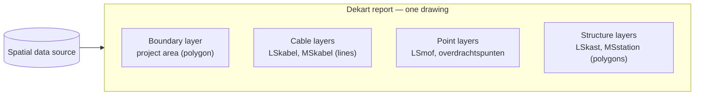

# Visualization Concept: Viewing Drawings in Dekart

## Why Dekart

[Dekart](https://dekart.xyz) is an open-source, self-hosted map analytics platform — a
self-hosted alternative to services like CARTO and Felt. It was chosen because:

- **Self-hosted.** Utility network data is sensitive; the whole stack can run inside the
  organisation's own environment, with the organisation's own authentication in front of it.
- **Query-driven, with file upload.** Dekart turns queries against a connected data source
  into map layers, and also accepts direct uploads of common map-ready geodata files. Both
  match what the ingestion pipeline can produce, so no custom map application has to be
  built.
- **Proven rendering.** Maps are rendered with Kepler.gl, a mature WebGL engine that
  comfortably handles the volume of a drawing (hundreds to thousands of features) and far
  beyond.
- **Shareable reports.** A composed map is saved as a report with a link — a colleague opens
  the same view without redoing any work.

Licensing, at a mention level: Dekart is available under an open-source licence (AGPL) with a
commercial licence offered alongside; the choice between them is an adoption decision, not an
architectural one.

## How a drawing becomes a map

The unit of viewing is a **report**: a saved Dekart map composed of layers, where each layer
is fed by one query against the spatial data source.

For an NLCS++ drawing the natural composition is **one layer per asset category**, plus the
project boundary:

- **The project boundary** is the orientation layer: it frames the initial view and shows the
  extent within which the drawing claims to describe the network.
- **Cables** render as lines; low-voltage and medium-voltage cables belong in separate layers
  so they can be styled and toggled independently.
- **Joints and transfer points** render as points on top of the cable lines.
- **Cabinets and stations** render as polygons (they are drawn to scale in the source data;
  at wide zoom they are effectively points, so a point-style rendering may serve better until
  the user zooms in).

Because each layer is just a query, this composition is a convention, not a build artifact:
a user can add, split, or filter layers ad hoc — for example, a layer showing only joints with
a particular function.

## Styling by attributes

The attributes carried by every asset (see the format document) drive the visual language:

- **Colour by Status** — the most useful default on revision drawings: existing (*BESTAAND*),
  new, and removed assets in clearly distinct colours shows at a glance what the project
  changed.
- **Colour by Bedrijfstoestand** — operational state, e.g. highlighting anything not
  *IN BEDRIJF*.
- **Distinguish network levels** — low-voltage vs medium-voltage assets in different hues,
  matching how engineers think about the network.
Beyond styling, attributes are also directly readable per asset — see
[Inspecting assets](#inspecting-assets) below.

## Inspecting assets

The viewer's answer to *"what is this?"* is built into Dekart's map interaction — it requires
no custom development:

- **Hover** an asset (a cable line, a joint, a cabinet) and a tooltip appears showing its
  attribute values.
- **Click** an asset to select it, so its values can be read calmly and compared while moving
  the mouse away.

What appears is the descriptive data that asset carries in the drawing: status
(*BESTAAND*, new, removed), operational state (*Bedrijfstoestand*), owner and manager
(*Eigenaar*/*Beheerder*), function (*Functie*), construction date (*DatumAanleg*), and
identifiers linking back to the source file or the asset registration.

Two conceptual points matter for developers:

- **Which fields show is a per-layer choice.** Each layer selects its own attributes and
  configures which of them the tooltip presents — a cable layer can surface different fields
  than a joint layer, keeping tooltips relevant instead of exhaustive.
- **Inspection quality is decided at ingestion time, not in Dekart.** Only attributes that the
  conversion pipeline loaded as columns alongside the geometry (see
  [03-system-architecture.md](03-system-architecture.md)) can ever appear in a tooltip. If
  users must be able to see it, the pipeline must carry it.

## What the user can do

- **Explore**: pan, zoom, toggle layers, and inspect any asset's attributes by hovering or
  clicking it, over a recognisable base map.
- **Filter**: narrow a layer by any attribute — only removed assets, only assets of a given
  owner, only cables laid after a date.
- **Compose and share**: save the composed map as a report and share the link; recipients see
  the same drawing without touching the upload flow.
- **Ask new questions**: because the data is queryable, questions nobody anticipated ("how
  many joints of this type are in the project area?") are a query away rather than a feature
  request.

## What Dekart does *not* do here

Developers should know where the platform's responsibility ends and custom work (or accepted
limitation) begins:

- **No NLCS++ import.** Dekart can import common map-ready geodata files uploaded by a user,
  but never XML/GML/NLCS++. The ingestion half of the architecture is irreplaceable — at most
  its output changes shape (database records or a map-ready file).
- **No CAD symbology.** The NLCS drawing standard prescribes line types, symbols, and layer
  conventions for CAD sheets. Dekart renders generic map styling (colours, widths, point
  sizes) — the map is a faithful *data* view, not a facsimile of the CAD drawing. If
  NLCS-style symbology ever becomes a hard requirement, that is custom work outside Dekart.
- **No coordinate conversion.** Dekart expects web-map-ready coordinates; the RD-to-WGS84
  conversion must have happened in the pipeline.
- **No drawing management.** Dekart knows reports and queries, not "drawings" or "revisions".
  Any lifecycle around uploaded drawings (listing, replacing, deleting, comparing revisions)
  lives in the ingestion half or its data model.
