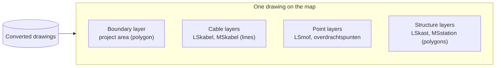

# Visualization Concept: Viewing Drawings in the Map Viewer

## Why an own viewer

The viewer is this project's own web application, built on an open-source web-mapping
library (MapLibre GL JS). It replaced the original plan of using Dekart unmodified — the
platform decision recorded in the task roadmap (task 002). It was chosen because:

- **The interface is the product.** The roadmap needs custom controls — in-viewer upload,
  layer toggles per drawing and per object type, object search and highlighting. An
  off-the-shelf analytics tool offers no extension points for that; an own viewer owns the
  whole interface.
- **Self-hosted.** Utility network data is sensitive; the whole stack runs inside the
  organisation's own environment, with the organisation's own authentication in front of it.
- **Proven rendering.** The map is rendered with a mature WebGL mapping engine that
  comfortably handles the volume of a drawing (hundreds to thousands of features) and far
  beyond.
- **Direct fit to the pipeline.** The ingestion half produces map-ready, attribute-carrying
  drawing files; the viewer renders exactly that, with no hand-off machinery in between.

Dekart, the earlier platform, remains usable alongside as an ad-hoc analysis tool; nothing
in the viewer depends on it.

## How a drawing becomes a map

The unit of viewing is a **drawing**: the viewer lists the converted drawings and shows any
selection of them on one map. Each drawing is composed as **one layer per asset category**,
plus the project boundary:

- **The project boundary** is the orientation layer: it frames the initial view and shows the
  extent within which the drawing claims to describe the network.
- **Cables** render as lines; low-voltage and medium-voltage cables are separate layers so
  they can be styled and toggled independently.
- **Joints and transfer points** render as points on top of the cable lines.
- **Cabinets and stations** render as polygons (they are drawn to scale in the source data;
  at wide zoom they are effectively invisible until the user zooms far in — that is the
  data, not a defect).

Every category keeps a fixed, recognisable colour that is identical across drawings, so a
user who knows one map can read them all. The base map underneath is a muted dark map by
default, with a Dutch national base map (BRT) as the alternative; the drawing's colours are
tuned to stay readable on both.

## Inspecting assets

The viewer's answer to *"what is this?"* is built into the map interaction:

- **Hover** an asset (a cable line, a joint, a cabinet) and a tooltip appears showing its
  attribute values.
- **Click** an asset to pin that tooltip, so its values can be read calmly and compared while
  moving the mouse away.

What appears is the descriptive data that asset carries in the drawing: status (*BESTAAND*,
new, removed), operational state (*Bedrijfstoestand*), owner and manager
(*Eigenaar*/*Beheerder*), function (*Functie*), construction date (*DatumAanleg*), and
identifiers linking back to the source file or the asset registration.

One conceptual point matters for developers: **inspection quality is decided at ingestion
time, not in the viewer.** Only attributes that the conversion pipeline carried alongside the
geometry (see [03-system-architecture.md](03-system-architecture.md)) can ever appear in a
tooltip. If users must be able to see it, the pipeline must carry it.

## What the user can do

- **Explore**: pan, zoom, and inspect any asset's attributes by hovering or clicking it, over
  a recognisable base map.
- **Choose what is shown**: toggle drawings on and off, and toggle object types on and off,
  independently — e.g. only the joints of one revision, or all cables of every loaded
  drawing at once.
- **Switch the base map**: a muted dark base map for contrast, or the Dutch national base map
  for recognisable surroundings.

The task roadmap extends this over time — in-viewer upload of new drawings, richer layer
selection, and object search with highlighting are their own tasks and are specified there.

## What the viewer does *not* do

Developers should know where the viewer's responsibility ends and other work (or accepted
limitation) begins:

- **No NLCS++ import.** The viewer renders converted, map-ready drawing data only. The
  ingestion half of the architecture is irreplaceable; XML never reaches the browser.
- **No CAD symbology.** The NLCS drawing standard prescribes line types, symbols, and layer
  conventions for CAD sheets. The viewer renders generic map styling (colours, widths, point
  sizes) — the map is a faithful *data* view, not a facsimile of the CAD drawing. If
  NLCS-style symbology ever becomes a hard requirement, that is dedicated rendering work.
- **No coordinate conversion.** The viewer expects web-map-ready coordinates; the RD-to-WGS84
  conversion must have happened in the pipeline.
- **No editing.** This is a viewer; it never modifies or produces NLCS++ files.
